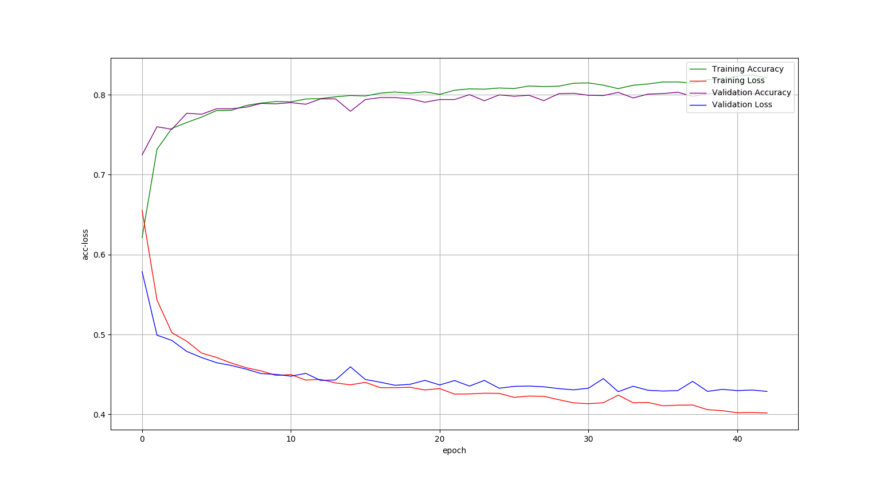
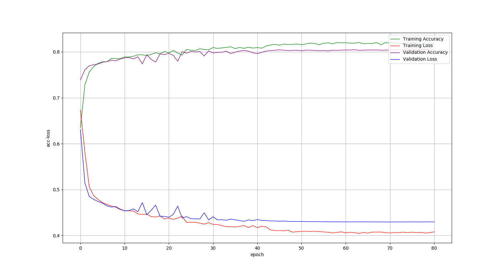
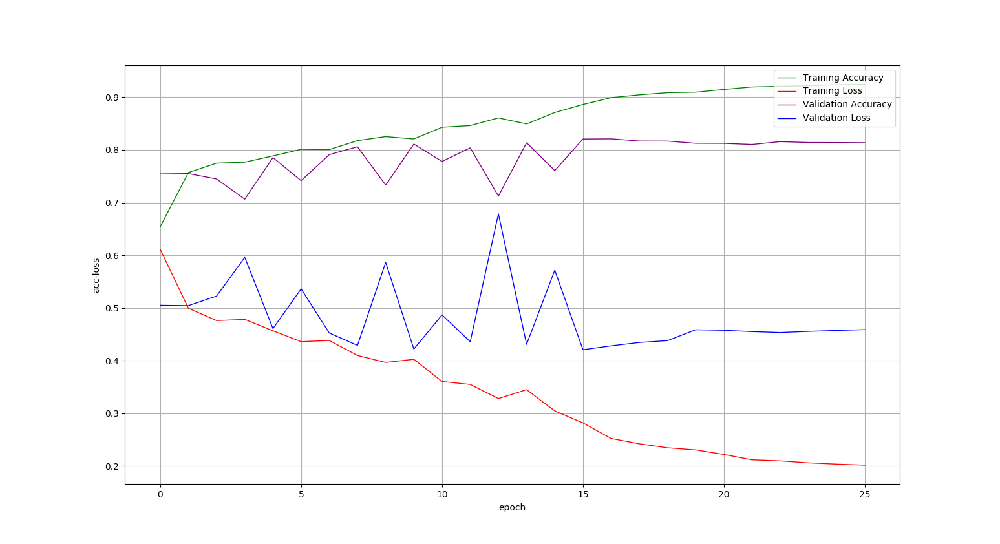
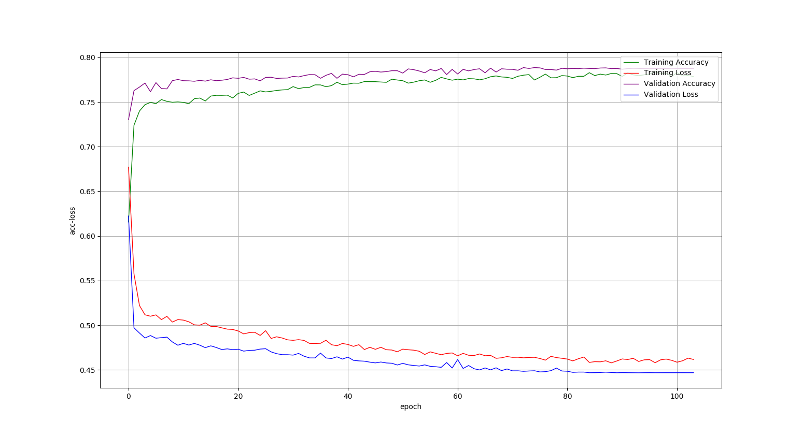
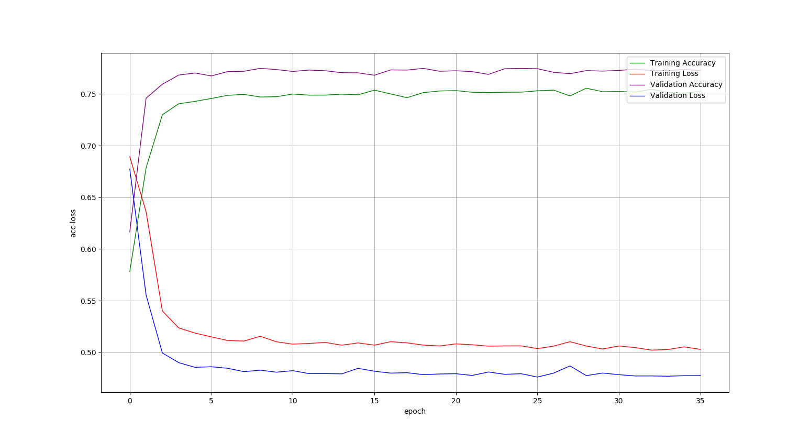
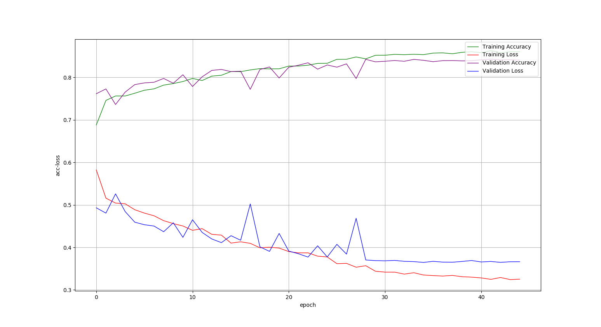

# Sentiment Analysis Implementations
基于电影评论数据的中文情感分析  
**Chinese Sentiment Analysis** based on ML(Machine Learning) and DL(Deep Learning) algorithms, including Naive-Bayes, Decision-Tree, KNN, SVM, NN(MLP), CNN, RNN(LSTM).  

## 0. Requirements
All code in this project is implemented in [Python3.6+](https://www.python.org/downloads/).  
And all the essential packages are listed in `requirements.txt`, you can install them by `pip install -r requirements.txt -i https://pypi.douban.com/simple/`  
[Anaconda](https://docs.anaconda.com/anaconda/) or [virtualenv + virtualenvwrapper](http://www.jianshu.com/p/44ab75fbaef2) are strongly recommended to manage your Python environments.

## 1. Data Preparation
**1).数据集**  
使用电影评论数据作为训练数据集. 其中, 训练数据集20000条(正负向各10000条); 测试数据集6000条(正负向各3000条)  

**2).数据预处理**  
1.去除停用词, 并使用jieba进行分词  
2.使用预训练的词向量模型，对句子进行向量化  

## 2. 各种实现方法准确率对比
| Algorithm | Accuracy(avg) | Accuracy(fasttext) | Accuracy(matrix) | 说明 |
| :---: | :---: | :---: | :---: | :---: |
| Naive-Bayes | 73.72% | 74.32% | 69.34%(拼接和补齐) | / |
| Decision-Tree | 65.27% | 66.84% | 55.34%(拼接和补齐) | / |
| KNN | 76.69%({'n_neighbors': 19}) | 77.43%({'n_neighbors': 17}) | /(拼接和补齐) | 使用GridSearchCV进行参数选择 |
| SVM | 79.29%({'C': 1000, 'gamma': 0.001, 'kernel': 'rbf'}) | 78.93%({'C': 1000, 'kernel': 'linear'}) | /(拼接和补齐) | 使用GridSearchCV进行参数选择 |
| NN(MLP) | 80.24% | 80.41% | / | 采用EarlyStopping, ModelCheckpoint, ReduceLROnPlateau |
| CNN | / | / | 81.34% | 采用EarlyStopping, ModelCheckpoint, ReduceLROnPlateau |
| LSTM | 78.76% | 77.26% | 84.06% | 采用EarlyStopping, ModelCheckpoint, ReduceLROnPlateau |

## 3. 各种实现方法acc-loss曲线绘制
1).NN(MLP)实现方法结果绘制:  
使用词向量和的平均表示句子:  
  
使用fasttext.get_numpy_sentence_vector()词向量表示句子:  
  
2).CNN实现方法结果绘制:  
使用fasttext.get_numpy_vector()词向量组成的矩阵表示句子:  
  
3).LSTM实现方法结果绘制:  
使用词向量和的平均表示句子:  
  
使用fasttext.get_numpy_sentence_vector()词向量表示句子:  
  
使用fasttext.get_numpy_vector()词向量组成的矩阵表示句子:  
  

